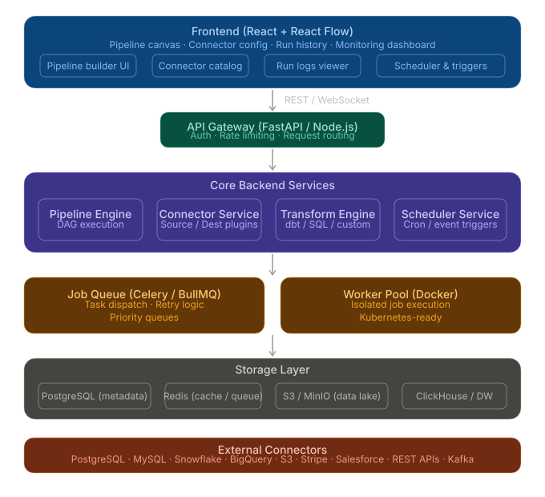

# Fluxion — Visual ETL Platform

Fluxion is a modern, visual ETL (Extract, Transform, Load) platform that lets you design data pipelines on a drag-and-drop canvas, manage connections to your data sources and destinations, and monitor pipeline runs in real time.

Built with **React + Vite + TypeScript** on the frontend and **Lovable Cloud** (managed Postgres + Edge Functions + Auth) on the backend.



---

## ✨ Features

- 🎨 **Visual Pipeline Editor** — Drag-and-drop canvas powered by [React Flow](https://reactflow.dev/) with sources, transforms, and destinations.
- 🔌 **Connector Library** — PostgreSQL, MySQL, Snowflake, BigQuery, CSV, HTTP APIs, S3, Webhooks, and more.
- 🔐 **Authentication** — Email/password auth with Row Level Security on every table.
- 📊 **Dashboard & Monitoring** — Run history, throughput charts (Recharts), success/failure stats.
- ⚡ **Serverless Execution** — Pipelines run via a Supabase Edge Function (`run-pipeline`) with structured logs.
- 🎯 **Modern SaaS UI** — Light theme inspired by Fivetran/Hightouch, built on shadcn/ui + Tailwind CSS.

---

## 🛠 Tech Stack

| Layer        | Technology                                            |
|--------------|-------------------------------------------------------|
| Frontend     | React 18, Vite 5, TypeScript 5, Tailwind CSS v3       |
| UI           | shadcn/ui, Radix UI, lucide-react                     |
| Canvas       | React Flow                                            |
| State / Data | Zustand, TanStack Query                               |
| Charts       | Recharts                                              |
| Backend      | Lovable Cloud (Supabase: Postgres, Auth, Edge Funcs)  |
| Routing      | React Router v6                                       |

---

## 📁 Project Structure

```
.
├── src/
│   ├── canvas/              # React Flow custom nodes
│   ├── components/          # Reusable UI + layout components
│   │   ├── layout/          # AppShell, PageHeader
│   │   └── ui/              # shadcn/ui primitives
│   ├── hooks/               # useAuth, etc.
│   ├── integrations/
│   │   └── supabase/        # Auto-generated client + types
│   ├── lib/                 # Connector registry, utils
│   ├── pages/               # Route-level pages
│   │   ├── Landing.tsx
│   │   ├── Auth.tsx
│   │   ├── Dashboard.tsx
│   │   ├── Pipelines.tsx
│   │   ├── PipelineEditor.tsx
│   │   ├── Connections.tsx
│   │   └── Runs.tsx
│   ├── App.tsx
│   └── main.tsx
├── supabase/
│   ├── functions/
│   │   └── run-pipeline/    # Edge function that executes pipelines
│   ├── migrations/          # SQL migrations
│   └── config.toml
├── index.html
├── tailwind.config.ts
├── vite.config.ts
└── package.json
```

---

## 🗄 Data Model

| Table            | Purpose                                                          |
|------------------|------------------------------------------------------------------|
| `profiles`       | User profile data (auto-created on signup via trigger)           |
| `connections`    | Stored credentials/configs for external systems                  |
| `pipelines`      | Pipeline definitions including the React Flow `graph` (JSONB)    |
| `pipeline_runs`  | Execution history with status, duration, row counts, and logs    |

All tables are protected by **Row Level Security** — users can only access their own rows.

---

## 🚀 Getting Started

### Prerequisites

- [Node.js](https://nodejs.org/) 18+ and [Bun](https://bun.sh/) (or npm/pnpm)
- A Lovable project with **Lovable Cloud** enabled (the backend is provisioned automatically)

### Local development

```bash
# Install dependencies
bun install

# Start the dev server
bun run dev
```

The app will be available at `http://localhost:8080`.

### Environment

The `.env` file is auto-generated by Lovable Cloud and contains:

```
VITE_SUPABASE_URL=...
VITE_SUPABASE_PUBLISHABLE_KEY=...
VITE_SUPABASE_PROJECT_ID=...
```

Do not edit it manually — it stays in sync with your Cloud backend.

---

## 🧪 Scripts

| Command          | Description                       |
|------------------|-----------------------------------|
| `bun run dev`    | Start Vite dev server             |
| `bun run build`  | Production build                  |
| `bun run preview`| Preview the production build      |
| `bunx vitest`    | Run unit tests                    |

---

## 🌐 Deployment

This project is developed in [Lovable](https://lovable.dev). To deploy:

1. Open the project in Lovable
2. Click **Publish** in the top-right
3. (Optional) Connect a custom domain under Project → Settings → Domains

You can also self-host: connect the project to GitHub, clone the repo, and deploy the built `dist/` folder to any static host (Vercel, Netlify, Cloudflare Pages, etc.). The backend will continue to run on Lovable Cloud.

---

## 🤝 Contributing

This project syncs bidirectionally with GitHub when connected via Lovable's GitHub integration. You can:

- Edit in Lovable → changes auto-push to GitHub
- Push to GitHub → changes auto-sync to Lovable
- Work locally, open PRs, use GitHub Actions — all standard Git workflows apply

---

## 📄 License

MIT
